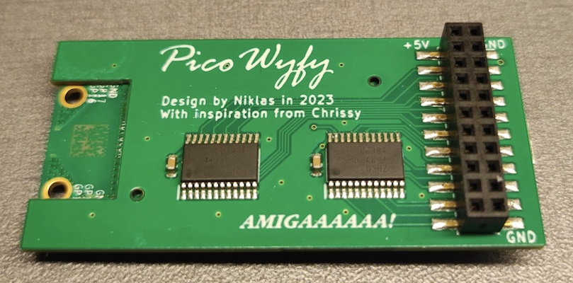
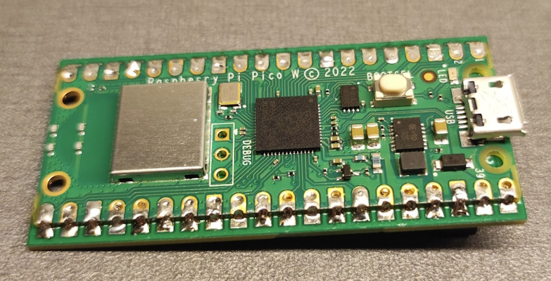
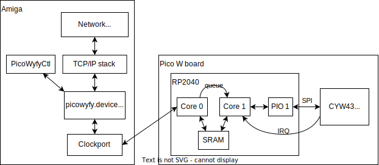

# PicoWyfy

PicoWyfy is a wireless network interface controller (WNIC) that connects to the
clockport of an Amiga computer. It is designed around the Raspberry Pi Pico W board.

|    |    |
| ------------- |---------------|
|       |  |

## Community

There is a #picowyfy channel in the A314 Discord server.
Writing a message there is currently the only way to order a board.

The invite link for the Discord server: [https://discord.gg/TGZNKnA](https://discord.gg/TGZNKnA).

## Software

The following files shall reside on the Amiga:

| Name            | Location | Description |
| --------------- |----------|-------------|
| picowyfy.device | DEVS:Networks | SANA-II device driver |
| PicoWyfyCtl     | C: | Adapter control program |
| picowyfy.config | DEVS: | Device driver configuration file (optional) |
| PicoWyfy | DEVS:NetInterfaces | Network interface definition |

These files are available in the [latest release](https://github.com/niklasekstrom/picowyfy/releases).

## PicoWyfyCtl command

The PicoWyfyCtl command has multiple sub-commands:

- `status`: prints the status of the network adapter
- `scan`: scans for wifi networks in range
- `connect`: connects the adapter to a wifi network
- `disconnect`: disconnects the adapter from the currently connected network

Run the command without arguments to print usage help.

## Configuration file

A configuration file may be written to `DEVS:picowyfy.config`.
The configuration file is a text file, where each line has the format `<key> = <value>`.
The keys are:

- `ClockportAddress`: the address (in hexadecimal) of the clock port.
- `Interrupt`: the interrupt number used, either: 2 (INT2), 3 (Vertical blank), or 6 (INT6).

If the configuration file is not present then the default values are used, which are:

```text
ClockportAddress = D80001
Interrupt = 6
```

## Architecture

This is a high level description of PicoWyfy's architecture.

The RP2040 has two ARM Cortex-M0+ cores, core 0 and core 1:

- Core 0 is essentially a slave to the Amiga, and executes a busy loop in which
it handles the reads and writes that the Amiga performs towards the clockport.
- Core 1 is responsible for communicating with the CYW43439 wifi chip.

The two cores communicate with each other by reading and writing through the
SRAM embedded in the RP2040.
Core 0 (and therefore the Amiga) is able to send commands to core 1 through a queue.
The interrupt pin on the clockport can be asserted by core 1 and negated by core 0,
so that the Amiga can be notified that new information is available for reading.


